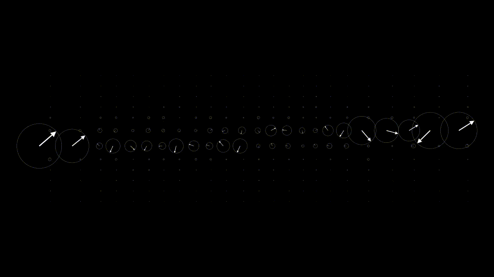
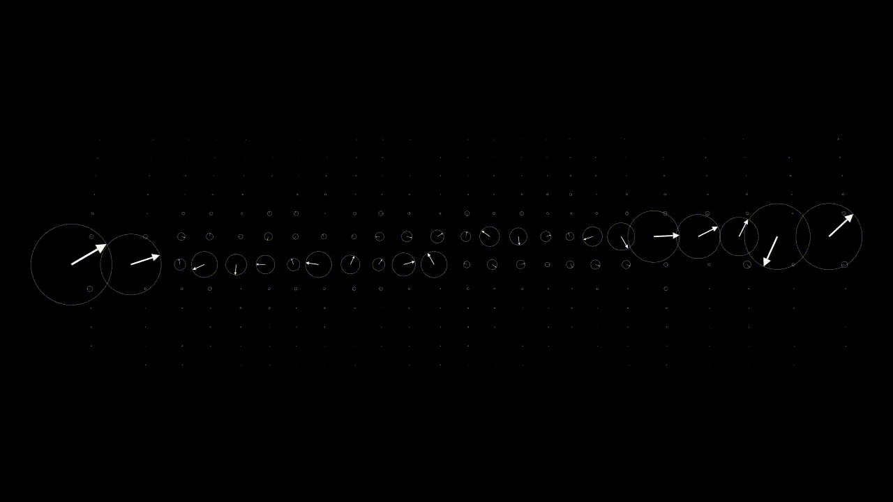
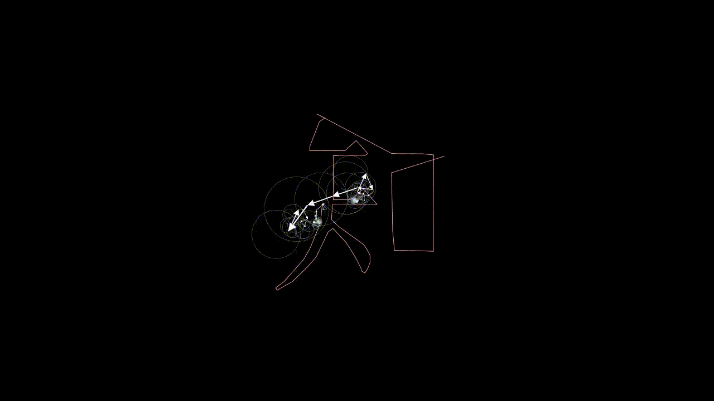

# Fourierer Drawing

这个项目使用傅立叶级数展开，根据给定的参数方程、文本符号或SVG文件，生成一系列动画。

## 动画概览

以下是三个主要的动画示例：**早期阶段的独立旋转箭头**、**组合箭头效果**、和**傅立叶级数绘图**。



<center>早期阶段的独立旋转箭头</center>



<center>组合箭头效果</center>



<center>傅立叶级数绘图</center>

## 安装和使用说明

1. 安装FFmpeg，参考[这个链接](https://blog.csdn.net/csdn_yudong/article/details/129182648)，我安装的是7.0.2；

2. 创建环境

    ```bash
    conda create -n manim python=3.10 -y
    conda activate manim
    pip install manim==0.18.1
    ```

3. 运行

    ```bash
    python -m manim fourier_text.py DrawFourierSoomth -p
    ```

安装完毕后，即可直接运行项目。

## 实现原理

关于如何实现这个项目，你可以参考下面的文章：[动手实现manim傅里叶级数动画](https://zhuanlan.zhihu.com/p/648064403)。

## 如何使用SVG文件

如果你想使用SVG文件，可以将下面的代码片段替换fourier_text.py中的相应部分：

```python
# 获取SVG对象中的矢量路径
def get_path(file_path):
    shape = SVGMobject(file_path)
    path = shape.family_members_with_points()[0]
    return path
```

