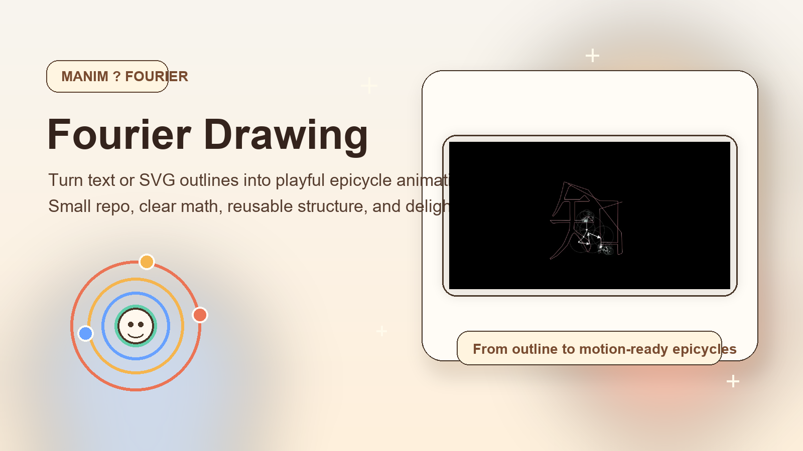

<p align="center">
  
</p>

<h1 align="center">Fourier Drawing</h1>

<p align="center">
  Animate text and outline shapes with Fourier epicycles in Manim.
</p>

<p align="center">
  
  
  
</p>

> A compact, reusable Manim project for turning outlines into rotating-vector drawings. Small enough to understand in one sitting, polished enough to build on.

## Why This Project

Most Fourier drawing demos are fun to watch but awkward to reuse: the math, path extraction, animation logic, and one-off parameters usually live in a single script.

This repository takes the same visual idea and packages it into something friendlier for real use:

- clearer module boundaries
- reusable scene configuration
- a direct path from "cool demo" to "my own text / logo / SVG"
- documentation that helps new users get from clone to render quickly

If you enjoy math visualizations, generative animation, or elegant little graphics tools, this repo is built to be a pleasant starting point.

## Highlights

- Render text outlines as Fourier epicycle animations with Manim.
- Keep the original `manim fourier_text.py ...` workflow for quick experimentation.
- Reuse the core logic from a lightweight Python package instead of editing one giant script.
- Tune order, sampling density, timing, and layout through a single config object.
- Swap text outlines for SVG outlines when you want to animate logos or custom shapes.

## Demo

| Stage | Preview |
| --- | --- |
| Preview the epicycles before chaining them together |  |
| Rearrange vectors into a connected chain |  |
| Trace the final outline from the last vector tip |  |

## Quick Start

### 1. Install system prerequisites

Manim needs a local rendering toolchain. Make sure you have:

- Python 3.11+
- FFmpeg available in `PATH`
- the platform dependencies required by Manim Community Edition

Official setup docs:

- [Manim installation guide](https://docs.manim.community/en/stable/installation.html)
- [Manim Windows guide](https://docs.manim.community/en/stable/installation/windows.html)

### 2. Create a virtual environment

```powershell
git clone https://github.com/jialefu/fourier-drawing.git
cd fourier-drawing
python -m venv .venv
.venv\Scripts\Activate.ps1
python -m pip install --upgrade pip
python -m pip install -e .
```

If you prefer the pinned requirements file:

```powershell
python -m pip install -r requirements.txt
```

### 3. Render the default scene

```powershell
manim -pql fourier_text.py DrawFourierSmooth
```

The original scene name is still supported for backward compatibility:

```powershell
manim -pql fourier_text.py DrawFourierSoomth
```

Manim will typically write the preview video to:

```text
media\videos\fourier_text\480p15\DrawFourierSmooth.mp4
```

## Customize the Animation

The quickest path is to edit `DEFAULT_CONFIG` in [`fourier_text.py`](fourier_text.py).

### Change the text

```python
from fourier_drawing.config import FourierDrawingConfig, TextSource

DEFAULT_CONFIG = FourierDrawingConfig(
    source=TextSource(text="Hello", font="Aptos"),
    order=160,
    samples=5000,
    draw_duration=12.0,
)
```

### Build your own scene

```python
from fourier_drawing.config import FourierDrawingConfig, SvgSource
from fourier_drawing.scenes import FourierDrawingScene


class LogoScene(FourierDrawingScene):
    drawing_config = FourierDrawingConfig(
        source=SvgSource("assets/logo.svg"),
        order=180,
        samples=6000,
        draw_duration=12.0,
        sort_by_amplitude=True,
    )
```

Then render it with:

```powershell
manim -pqh my_scene.py LogoScene
```

## Configuration Guide

| Option | What it controls | Typical adjustment |
| --- | --- | --- |
| `source` | Input outline from text or SVG | Change the text, font, or SVG path |
| `order` | Number of positive and negative Fourier frequencies | Increase for more detail, decrease for faster renders |
| `samples` | Path sampling density before decomposition | Increase for smoother outlines |
| `vector_scale` | Visual size of the epicycle chain | Increase when the trace looks too small |
| `preview_duration` | How long the vector grid spins before rearranging | Increase if you want a longer "math reveal" |
| `transition_duration` | Time spent moving from grid preview to connected chain | Increase for a calmer, more cinematic transition |
| `draw_duration` | Time spent tracing the final shape | Increase for slower, easier-to-follow motion |
| `track_color` / `trace_color` | Visual styling of the helper circles and final path | Use to match your own visual identity |
| `sort_by_amplitude` | Whether large vectors appear earlier in the chain | Useful for cleaner-looking epicycle layouts |

## Project Layout

```text
.
|-- fourier_drawing/
|   |-- config.py     # dataclasses and scene settings
|   |-- fourier.py    # path resampling and Fourier decomposition
|   |-- scenes.py     # reusable Manim scene implementation
|   `-- sources.py    # text/SVG outline extraction
|-- figs/             # demo assets used in the README
|-- fourier_text.py   # default entry point and compatibility scene
|-- pyproject.toml
`-- requirements.txt
```

## Quick Sanity Checks

The reusable math helpers can be verified without rendering a full video:

```powershell
python -m unittest discover tests
```

## Notes and Tradeoffs

- Disconnected contours are currently flattened into one sequential drawing path. That works well for many shapes, but complex multi-part glyphs may include connector strokes between contours.
- Render cost grows with both `order` and `samples`. Start with `-ql`, then move to higher quality once the motion feels right.
- Font support depends on your local machine. If a glyph renders incorrectly, explicitly choose a font that contains it.

## Why Star It?

Because tiny math tools with nice docs deserve a cozy little fan club.

More seriously: if this repo saves you time, gives you a clean Fourier drawing starting point, or inspires a remix, a star helps other people find it too.
