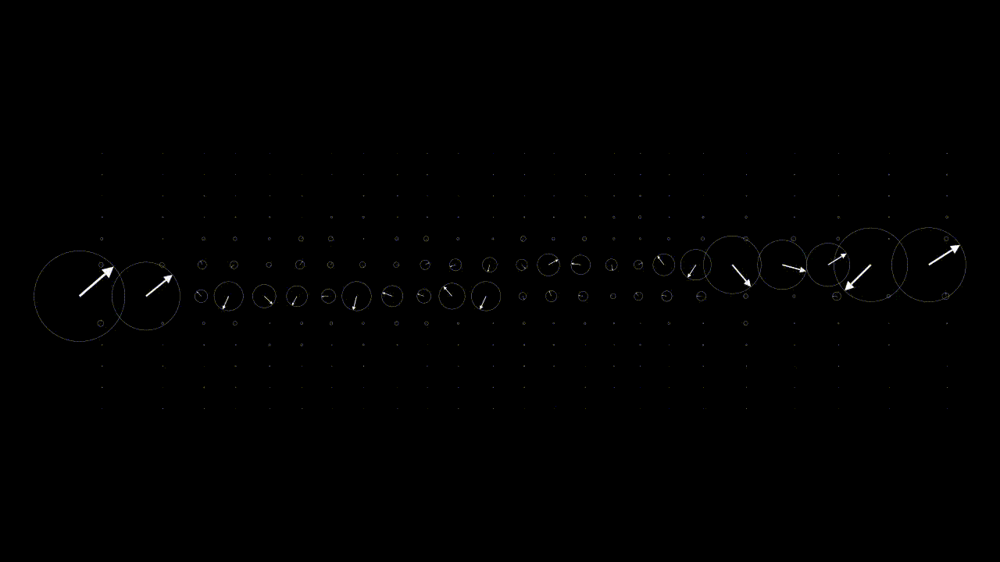
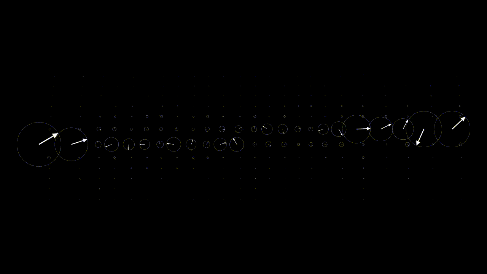
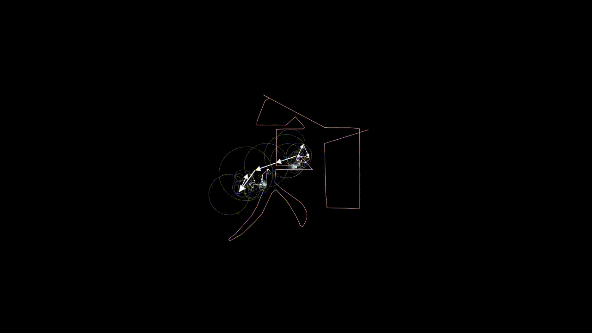

# Fourier Drawing

中文说明在前，English follows below.

这个项目使用 Manim Community Edition 把一个文字轮廓拆成傅立叶级数，并渲染出由旋转向量逐步描边的动画。





## 中文

### 项目概览

- 入口脚本：`fourier_text.py`
- 场景类：`DrawFourierSoomth`
- 当前默认绘制的文字：`知`
- 已验证命令：`manim -ql fourier_text.py DrawFourierSoomth`

### 当前验证环境

- Windows 11 / PowerShell
- Python 3.12.3
- Manim Community 0.20.1
- NumPy 2.2.4
- FFmpeg 7.0.2

说明：
- README 主要推荐 Python 3.11 作为更稳妥的复现基线。
- 本仓库已在 Python 3.12.3 下完成安装与低清晰度渲染验证。

### 系统前置依赖

在安装 Python 包之前，请先确认下面两项：

1. 安装 FFmpeg，并确保 `ffmpeg` 已加入 `PATH`
2. 按 Manim 官方文档完成 Windows 本地依赖检查

官方文档：
- [Manim installation guide](https://docs.manim.community/en/stable/installation.html)
- [Installing Manim locally](https://docs.manim.community/en/stable/installation/windows.html)

如果你使用的是常规 Windows Python 环境，Manim 的 `pycairo` / `manimpango` 现在通常可以通过 wheel 直接安装；但如果本机环境较旧或缺少底层依赖，仍然应该以官方安装文档为准。

### 安装步骤

推荐使用独立虚拟环境。

```powershell
python -m venv .venv
.venv\Scripts\Activate.ps1
python -m pip install --upgrade pip
python -m pip install -r requirements.txt
```

如果 PowerShell 禁止激活脚本，也可以不激活，直接这样执行：

```powershell
.venv\Scripts\python -m pip install --upgrade pip
.venv\Scripts\python -m pip install -r requirements.txt
```

### 运行方式

快速低清晰度预览：

```powershell
manim -p -ql fourier_text.py DrawFourierSoomth
```

如果没有激活虚拟环境：

```powershell
.venv\Scripts\manim -p -ql fourier_text.py DrawFourierSoomth
```

### 输出位置

低清晰度渲染完成后，默认视频通常在：

```text
media\videos\fourier_text\480p15\DrawFourierSoomth.mp4
```

Manim 也会在 `media\videos\fourier_text\480p15\partial_movie_files\` 下生成中间片段文件。

### 自定义内容

修改要绘制的文字：

在 `fourier_text.py` 中找到：

```python
tex_mob = Text(r"知")
```

把 `"知"` 改成你想绘制的文本即可。

如果某个字符无法正常显示，优先尝试：

- 换一个系统已安装的字体，例如 `Text("知", font="Microsoft YaHei")`
- 改成英文字符或数字确认是否是字体缺失问题

使用 SVG 路径：

```python
def get_path(file_path):
    shape = SVGMobject(file_path)
    path = shape.family_members_with_points()[0]
    return path
```

然后把原本的 `get_path()` 替换成基于 SVG 的实现，并传入你的 SVG 文件路径。

### 常见问题

- `ffmpeg` not found：说明 FFmpeg 没有安装，或没有加入系统 `PATH`
- `ModuleNotFoundError: manim`：说明没有在当前环境安装依赖，或终端没进入正确的虚拟环境
- 中文字符显示为空白/方框：通常是字体问题，给 `Text(...)` 显式指定支持中文的字体
- `pycairo` / `manimpango` 安装失败：优先参考 Manim 官方 Windows 安装文档检查本机原生依赖
- 渲染很慢：当前动画箭头较多，先用 `-ql` 验证流程，再考虑更高画质

## English

### Overview

This project uses Manim Community Edition to decompose a text outline into Fourier series components and animate the drawing process with rotating vectors.

- Entry script: `fourier_text.py`
- Scene class: `DrawFourierSoomth`
- Default glyph: `知`
- Verified command: `manim -ql fourier_text.py DrawFourierSoomth`

### Verified Environment

- Windows 11 / PowerShell
- Python 3.12.3
- Manim Community 0.20.1
- NumPy 2.2.4
- FFmpeg 7.0.2

Notes:
- Python 3.11 is the recommended baseline for reproducible setup.
- The repository was installed and smoke-tested locally with Python 3.12.3.

### System Prerequisites

Before installing Python packages, make sure:

1. FFmpeg is installed and available in `PATH`
2. Your Windows machine satisfies Manim's local installation requirements

Official docs:
- [Manim installation guide](https://docs.manim.community/en/stable/installation.html)
- [Installing Manim locally](https://docs.manim.community/en/stable/installation/windows.html)

### Install

Use an isolated virtual environment:

```powershell
python -m venv .venv
.venv\Scripts\Activate.ps1
python -m pip install --upgrade pip
python -m pip install -r requirements.txt
```

If you do not activate the environment:

```powershell
.venv\Scripts\python -m pip install --upgrade pip
.venv\Scripts\python -m pip install -r requirements.txt
```

### Run

Quick low-quality preview:

```powershell
manim -p -ql fourier_text.py DrawFourierSoomth
```

Without activation:

```powershell
.venv\Scripts\manim -p -ql fourier_text.py DrawFourierSoomth
```

### Output

The low-quality render is typically written to:

```text
media\videos\fourier_text\480p15\DrawFourierSoomth.mp4
```

### Customization

To change the rendered text, edit:

```python
tex_mob = Text(r"知")
```

If a CJK glyph does not render correctly, try a font that supports it, for example:

```python
Text("知", font="Microsoft YaHei")
```

To switch from text outlines to SVG input, replace the `get_path()` implementation with an `SVGMobject(...)`-based version and pass your SVG path.

### Troubleshooting

- `ffmpeg` not found: install FFmpeg and add it to `PATH`
- `ModuleNotFoundError: manim`: install dependencies in the correct environment
- Missing Chinese glyphs: specify a font that supports the target characters
- `pycairo` / `manimpango` installation issues: follow the official Windows installation guide for native dependencies
- Slow rendering: start with `-ql` before trying higher quality settings
